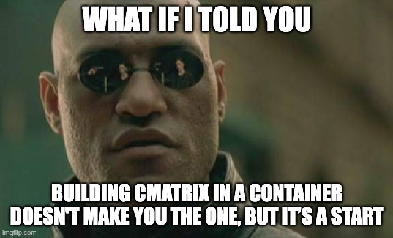

# DockerCon 2023 cMatrix Demo

In this talk by **James Spurin**, we'll explore how to build the cMatrix Terminal Screensaver into a Container!

Along way we'll sprinkle in best practices and multi-arch builds 🚀

<p align="center">
  
</p>

## Lab Environment

To run the lab used in the demo, firstly ensure you're running a recent version of Docker Desktop.

Docker Desktop Extensions should be enabled by default but if not -

### Enable Docker Desktop extensions

Go to Preferences -> Extensions -> Check
   "Enable Docker Extensions"

After this we can install the extension -

### Install the extension from the command line

```
docker extension install spurin/dockercon-2023-cmatrix-extension:latest
```

Then, navigate to the Extension in the Docker Desktop Extensions pane.
